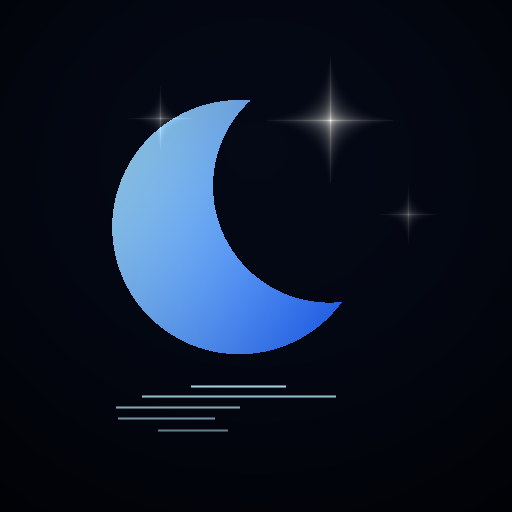

<div align="center">



# 极光睡眠 SomnaCare

**懂睡眠，更懂你。**

一款 100% 离线优先的 Android 睡眠记录与分析应用 · React 19 + Capacitor 7 原生封装

[](../../actions/workflows/build-apk.yml)
[](../../releases/latest)

</div>

---

## ✨ 功能总览

应用共五个分区（底栏切换）：

| 分区 | 功能 |
|---|---|
| 🌙 **睡眠** | 一键就寝 / 醒来记录；实时床头监测（真实麦克风环境声级采样 + 频谱可视化，本地 RMS→dBFS 计算，不上传任何音频）；睡眠分期图表；晨间总结与醒来心情 |
| 📊 **趋势** | 7 天睡眠时长 / 评分趋势图、90 分钟睡眠周期推演图（分级色块）、逐条记录管理与删除 |
| ✨ **AI 顾问** | 睡眠医学风格评估 + 对话式咨询。支持三种引擎：**DeepSeek 云端 API**（填自己的 Key）、**端侧离线模型**（wllama + Qwen3-0.6B 或原生 MediaPipe + Gemma 3 1B int4）、**纯本地规则引擎**（零配置离线兜底） |
| 👁 **护眼** | 全局护眼滤镜（SYSTEM_ALERT_WINDOW 悬浮窗，所有应用上方生效）：暖色减蓝光 + 屏幕减光双层，四场景预设（夜间 / 阅读 / 游戏 / 助眠）+ 自定义调色盘，定时开关支持跨午夜时段，通知栏一键关闭 |
| ⚙️ **偏好** | 四套主题（午夜蓝 / 纯黑 / 暖琥珀 / 宁静青绿，**桌面图标随主题联动换色**）、自定义闹钟（温和铃声 / 旋律，原生精确闹钟通道 + 30 秒渐弱钟声）、作息目标三字段联动编辑器、数据备份导入导出、PWA 导出 |

**其他特性**

- 🎨 Honor 风格三段式品牌开屏动画（水滴 → 月亮顺时针渲染 → 极光 + slogan）
- 🔊 五种 Web Audio 实时合成的助眠音（雨声 / 海浪 / 夜林虫鸣 / 粉噪音 / 颂钵），无任何音频文件下载
- 🌐 PWA 可安装版（桌面浏览器访问 dist 部署即可）
- 📴 断网可用：核心功能全部本地运行

## 📱 下载安装

**方式一（推荐）：GitHub Release 直链** —— 无需登录 GitHub：

1. 打开 [Releases 页面](../../releases/latest)；
2. 下载 `SomnaCare-vX.X.X-debug.apk`；
3. 手机上点开安装（需允许"安装未知来源应用"）；
4. 若之前装过旧版本，**请先卸载再安装**（桌面启动器会缓存旧图标）。

> 说明：APK 为 debug 签名（CI 自动构建），适合个人与朋友间分发；上架应用商店需自行配置正式签名。

**方式二：自己动手构建** —— 见下方[构建](#️-构建与开发)章节。

## 🔒 隐私与数据说明（诚实声明）

- **所有睡眠数据只存在手机本地**（WebView localStorage），无任何账号系统，不上传服务器；
- 睡眠分期是**基于作息起止点与 90 分钟超昼夜节律的科学模型推演值**——App 未读取体动 / 脑波传感器，各期时长与占比为估算值，界面上均已标注，**不能替代多导睡眠监测（PSG）等临床检测，不构成医疗建议**；
- 使用云端 AI 顾问需要**你自己的** DeepSeek API Key（存在本地，仅用于直连 DeepSeek 官方接口）；不填 Key 也能用端侧模型或纯本地规则引擎；
- 护眼滤镜需要系统"显示在其他应用上层"权限；全局滤镜的透明度按 Android 12+ 规范控制在触摸穿透豁免范围内，不影响任何应用的正常操作。

## 🔐 权限用途一览

| 权限 | 用途 |
|---|---|
| `SCHEDULE_EXACT_ALARM` / `USE_EXACT_ALARM` | 闹钟精确唤醒 |
| `POST_NOTIFICATIONS` | 闹钟响铃通道 / 护眼常驻通知 |
| `WAKE_LOCK` | 息屏后维持响铃流程 |
| `RECORD_AUDIO` | 仅"床头监测"页的环境声级采样（用户点击开启，可拒绝，拒绝后该功能诚实降级） |
| `RECEIVE_BOOT_COMPLETED` | 预留：重启后恢复闹钟调度 |
| `SYSTEM_ALERT_WINDOW` | 护眼全局滤镜悬浮窗（用户在系统设置中主动授权） |
| `FOREGROUND_SERVICE(+SPECIAL_USE)` | 护眼滤镜前台服务常驻 |

## 🧬 技术栈

- **前端**：React 19 + TypeScript + Vite + Tailwind CSS，Web Audio API 实时合成音效，手写 PNG/SVG 生成器产出全套品牌视觉（`tools/` 目录）
- **原生封装**：Capacitor 7（minSdk 24），GitHub Actions 全自动出包
- **端侧 LLM**：
  - Web 路径：[wllama](https://github.com/transformersjs/wllama)（llama.cpp WASM）+ Qwen3-0.6B GGUF，Cache API 自管理存储；
  - 原生路径：自定义 Capacitor 插件 [`plugins/cap-gemma-llm`](plugins/cap-gemma-llm) 封装 Google **MediaPipe LLM Inference**（Gemma 3 1B int4 `.task`，mmap 加载，支持断点续传 / Bearer 令牌 / 流式生成）；
- **护眼滤镜**：自定义前台服务 + `TYPE_APPLICATION_OVERLAY` 双悬浮层（暖色 + 减光），窗口级 alpha 按 Android 12+ 非信任触摸豁免规范控制，真实物理分辨率全屏覆盖

## 🏗️ 项目结构

```
somnacare/
├── src/
│   ├── components/        # 五大分区 UI、开屏动画、闹钟管理、声音播放器等
│   ├── utils/             # 睡眠评分/分期推演、临床规则引擎、端侧 LLM 引擎、
│   │                      # 原生闹钟调度、护眼滤镜、主题系统
│   └── types/             # 领域模型
├── plugins/cap-gemma-llm/ # 本地 Capacitor 插件（MediaPipe Gemma + 护眼服务 + 图标切换）
├── tools/                 # 图标/启动屏 PNG 生成器、manifest 注入脚本等
├── native-resources/      # 全密度图标、自适应前景、四主题图标、启动屏、铃声
├── public/                # PWA 图标
└── .github/workflows/     # CI：自动构建 APK；打 v* tag 自动发 Release
```

## 🛠️ 构建与开发

```bash
# 本地开发（浏览器）
npm install --legacy-peer-deps
npm run dev          # http://localhost:3000

# 构建 Web 产物
npm run build

# Android APK（需要 Android SDK / JDK 21）
npm run build && npx cap add android && npx cap sync android
cd android && ./gradlew assembleDebug
```

**不想配环境？** 推送代码到 `main` 分支，GitHub Actions 会自动构建 APK（Actions 页面下载，需登录）；**打一个 `v*` 标签**（如 `v1.0.1`）则会自动构建并发布到公开的 [Releases](../../releases)，任何人无需登录即可下载。

## ⚠️ 免责声明

本项目为个人作品，仅供学习与个人使用。所有睡眠分析结果均为模型估算值，不构成医疗诊断或治疗建议；如有睡眠障碍请咨询专业医生。

## 📄 License

[MIT](LICENSE)
